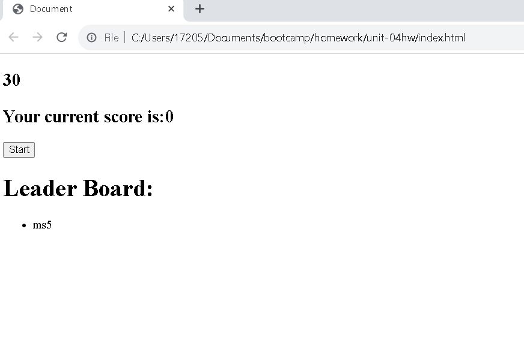

# Timed Quiz

## Description
This quiz is an excercise in generating dynamic elements inside of html using javascript, as well as use of localStorage using JSON.

## Screen Shot

## Links

[GitHub]https://github.com/Matt0Stark/question_quiz/
[GitHubPage]https://matt0stark.github.io/question_quiz/

## Reflections
I was proud of this quiz. Coming into coding with very little previous experience made for an uphill battle in the first couple weeks of the bootcamp, with javascript seeming especially daunting. The assignment was submitted without a style sheet, so was original was functional but boring question wise, and abjectly ugly to look at. It can be seen in its glory in the OriginalScreenShot, which I will proudly display here on my intetnet fridge as a reminder of my progress. 
